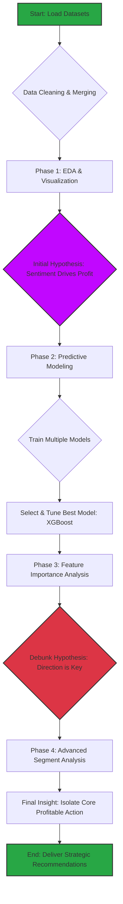

<br/>
<p align="center">
  <h1 align="center">Trader Performance vs. Market Sentiment Analysis 📈📉</h1>
</p>

<p align="center">
  An in-depth analysis to uncover the hidden patterns between trader performance on the Hyperliquid platform and the Fear & Greed market sentiment index.
</p>

<p align="center">
    
    
    
    
    
</p>

---

## 📋 Table of Contents

1. [Project Overview](#-project-overview)
2. [File Structure](#-file-structure)
3. [Google Colab Notebooks](#-google-colab-notebooks)
4. [Project Execution Flowchart](#-project-execution-flowchart)
5. [Detailed Walkthrough](#-detailed-walkthrough)
   - [Phase 1: Data Loading & Preparation](#phase-1-data-loading--preparation)
   - [Phase 2: Exploratory Data Analysis (EDA)](#phase-2-exploratory-data-analysis-eda)
   - [Phase 3: Predictive Modeling](#phase-3-predictive-modeling)
   - [Phase 4: Uncovering the Hidden Pattern](#phase-4-uncovering-the-hidden-pattern)
   - [Phase 5: Advanced & Segment Analysis](#phase-5-advanced--segment-analysis)
6. [Final Conclusion & Key Insights](#-final-conclusion--key-insights)
7. [Note on Missing Data](#-note-on-missing-data)
8. [Technologies Used](#-technologies-used)

---

## 🎯 Project Overview

The objective of this project is to analyze the relationship between trader performance on the Hyperliquid platform and the broader market sentiment, as measured by the Fear & Greed Index. The goal was to move beyond surface-level correlations to uncover deep, actionable insights that could inform smarter trading strategies. The analysis progressed from initial data exploration to building a highly accurate predictive model, ultimately revealing a non-obvious pattern that was the true driver of profitability.

---

## 📁 File Structure

The project repository follows the standardized submission format:

```
ds_yourname/
├── notebooks/
│   ├── notebook_1.ipynb
│   └── (optional) notebook_2.ipynb
├── csv_files/
│   ├── Historical_trader_data.csv
│   └── Fear_and_Greed_Index.csv
├── outputs/
│   ├── boxplot_pnl_by_sentiment.png
│   ├── timeseries_pnl_vs_sentiment.png
│   └── feature_importance.png
├── ds_report.pdf
└── README.md
```

---

## 🔗 Google Colab Notebooks

- **Main Analysis Notebook:** [Insert Your Google Colab Link Here]
- **(Optional) Second Notebook:** [Insert Your Google Colab Link Here]

---

## 🌊 Project Execution Flowchart

This flowchart illustrates the end-to-end workflow of the project, from initial data ingestion to the final strategic insights.



## 👣 Detailed Walkthrough

### Phase 1: Data Loading & Preparation

**Action:** The two primary datasets—Historical Trader Data and the Fear & Greed Index—were loaded into a pandas DataFrame.

**Process:**

- **Data Cleaning:** Timestamps were converted to a consistent datetime format to enable merging.
- **Merging:** The two DataFrames were merged on the date column, creating a single, unified dataset where each trade was enriched with the market sentiment data for that day.
- **Feature Engineering:** A crucial Win column was created (1 if Closed PnL > 0, else 0). This binary column served as the target variable for our classification model.

### Phase 2: Exploratory Data Analysis (EDA)

**Objective:** To get a high-level understanding of the data and form an initial hypothesis.

**Key Activities & Findings:**

- **Fear vs. Greed Table:** Aggregated data showed that, counterintuitively, trades made during periods of 'Extreme Greed' had the highest average PnL and win rate. This formed our initial hypothesis.
- **PnL Boxplot:** This visualization revealed that while the average PnL was high during 'Greed', the median PnL was close to zero. This indicated that profitability was driven by a small number of large outlier wins.
- **Correlation Analysis:** Both same-day and lagged correlation analyses showed a very weak linear relationship between the sentiment value and Daily_PnL, hinting that the connection was more complex.

### Phase 3: Predictive Modeling

**Objective:** To test our hypothesis by building a model that could predict whether a trade would be profitable.

**Process:**

- **Model Selection:** Several classification models were trained and evaluated (Logistic Regression, Random Forest, XGBoost, etc.).
- **Performance Comparison:** Tree-based models like XGBoost and Random Forest dramatically outperformed others. Distance-based models (KNN, SVM) failed due to the unscaled nature of the features, confirming that tree models were the right choice.
- **Hyperparameter Tuning:** The champion model, XGBoost, was fine-tuned using GridSearchCV. This process optimized its settings and boosted its F1-Score to an impressive 0.95, creating a highly accurate predictive tool.

### Phase 4: Uncovering the Hidden Pattern

**Objective:** To understand why the XGBoost model was so accurate by analyzing its decision-making process.

**The "Aha!" Moment:**

- **Feature Importance Analysis:** We extracted and plotted the feature importances from the tuned model.
- **Hypothesis Debunked:** The analysis delivered a non-obvious conclusion. Market sentiment (value) had a negligible importance of <1%.
- **The Real Driver:** The model's predictions were overwhelmingly driven by the trade Direction (e.g., 'Open Long', 'Sell'), which accounted for over 70% of the predictive power.

### Phase 5: Advanced & Segment Analysis

**Objective:** To use our new insight to pinpoint the exact source of profitability.

**Process:**

- **Isolating the "Golden Hour":** We filtered the data to look only at trades made during the 'Extreme Greed' phase.
- **Segmenting by Coin & Direction:** We then grouped these trades by Coin and Direction.
- **The Final Insight:** The analysis revealed that the strategy's entire success was almost exclusively driven by Selling the @107 asset. This single action within the 'Extreme Greed' zone was the engine of profitability.

## 💡 Final Conclusion & Key Insights

The project successfully moved beyond surface-level analysis to uncover a deep, actionable insight.

- **Sentiment is a Filter, Not a Signal:** The initial hypothesis was incorrect. Market sentiment is not a direct predictor of success. Instead, the 'Extreme Greed' phase acts as a filter, identifying the most profitable environment in which to trade.

- **The True Driver is Action:** Within this profitable environment, the most critical factor is the specific trade action.

- **The Golden Rule:** The data supports a clear, strategic rule: The highest probability of success lies in executing a Sell order on the @107 asset when the market is in 'Extreme Greed'.

- **Identified Weaknesses:** The analysis also identified clear loss-making patterns, such as trading during 'Extreme Fear' and executing Close Long orders, providing clear areas for strategic improvement.

## ⚠️ Note on Missing Data

It is important to note that the leverage column, while mentioned in the initial assignment description, was not present in the provided Historical Trader Data CSV file. Therefore, all planned analyses involving leverage (e.g., Leverage vs. Win Rate scatterplot, segmentation by leverage tier) could not be performed. The analysis conducted represents the most thorough investigation possible with the available data.

## 🛠️ Technologies Used

- **Language:** Python 3

- **Libraries:**
  - Pandas for data manipulation and analysis.
  - NumPy for numerical operations.
  - Scikit-learn for machine learning model training and evaluation.
  - XGBoost for the high-performance gradient boosting model.
  - Matplotlib & Seaborn for data visualization.

- **Environment:** Google Colab
